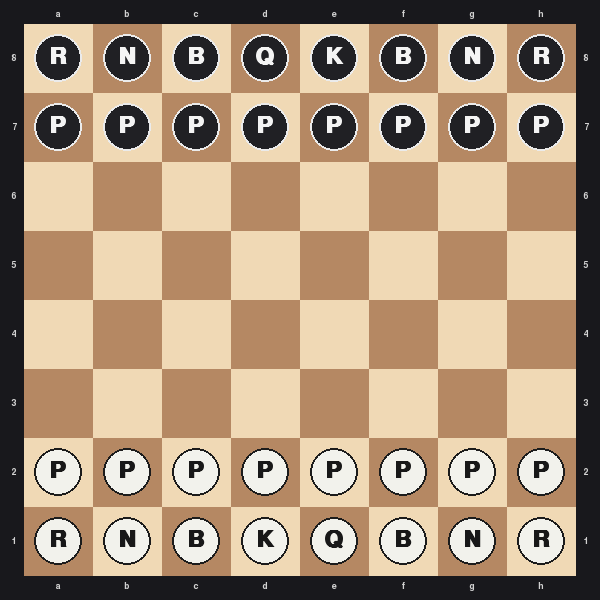
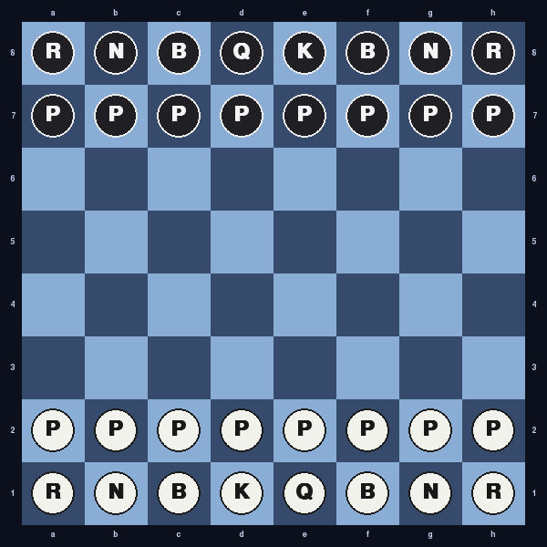
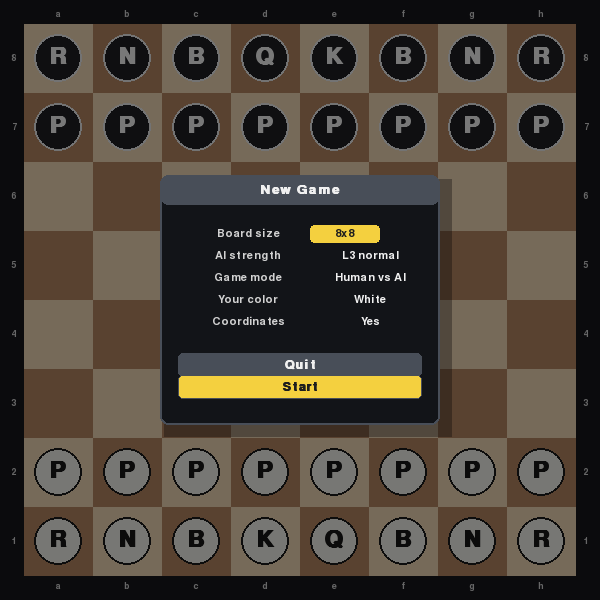
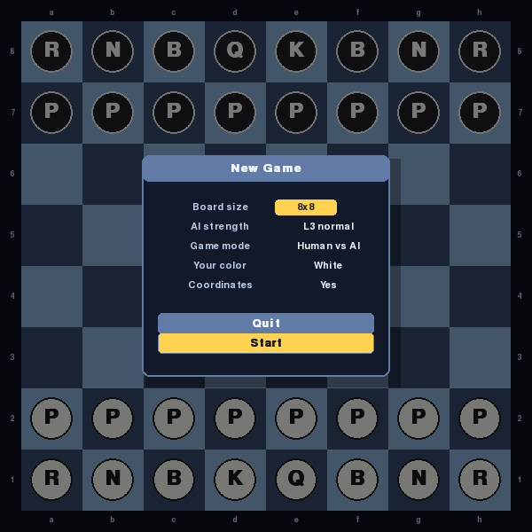
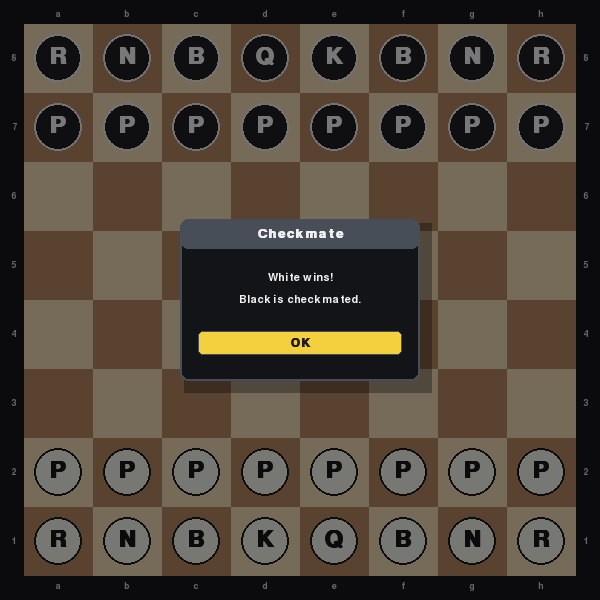
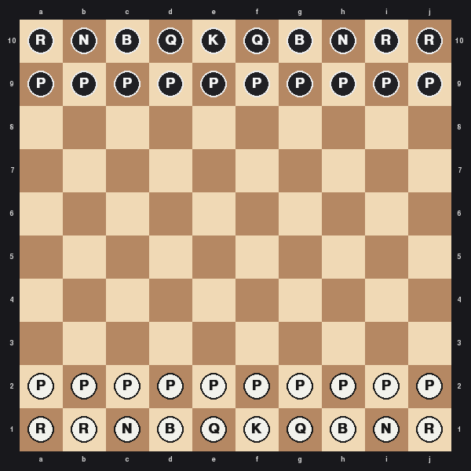
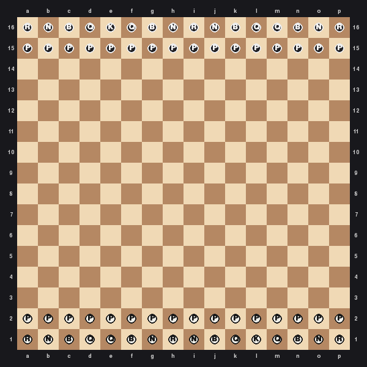
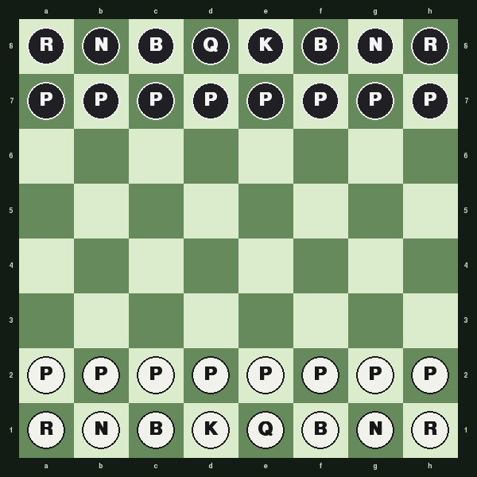
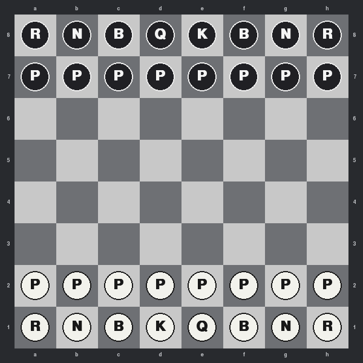
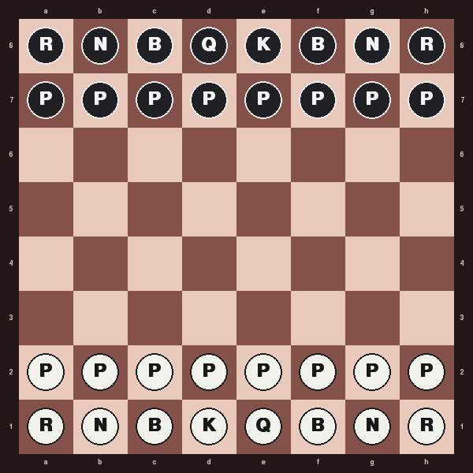

# Micro-Mate

A tiny chess engine and pygame UI inspired by the [Toledo Nanochess](http://nanochess.org/) family of minimal chess programs.

Supports 3×3, 4×4, 6×6, **8×8**, **10×10**, and **16×16** boards, five visual themes, adjustable AI depth, and runs on desktop or a Raspberry Pi framebuffer.

---

## Screenshots

| Classic | Midnight |
|---|---|
|  |  |

| New Game modal (Classic) | New Game modal (Midnight) |
|---|---|
|  |  |

| Checkmate modal | 10×10 board |
|---|---|
|  |  |

| 16×16 board |
|---|
|  |

---

## Install

```bash
# Requires Python 3.10+
pip install micro-mate
```

Or run from source with [uv](https://github.com/astral-sh/uv):

```bash
git clone https://github.com/mjbeswick/micro-mate
cd micro-mate
uv run micro-mate
```

---

## Usage

```
micro-mate [window_size] [options]
```

| Option | Description |
|---|---|
| `window_size` | Square window size in pixels (default: 720) |
| `--size RxC` | Skip menu, start with this board size (e.g. `8x8`, `10x10`) |
| `--new` | Ignore saved game and open the new-game dialog |
| `--theme NAME` | Startup theme: `classic`, `forest`, `midnight`, `grey`, `rosewood` |
| `--no-ai` | Human vs Human mode |
| `--ai-depth N` | AI search depth 1–5 (default: 3) |
| `--pgn FILE` | Load a PGN file (8×8 only; `-` for stdin) |
| `--coords` | Show rank/file labels around the board |

---

## Controls

| Key / Action | Effect |
|---|---|
| **Click** | Select piece / move to square |
| **Double-click** | Open new-game dialog |
| **Esc / R / N** | Open new-game dialog |
| **Space / Arrow keys** | Move cursor, confirm move |
| **[ / ]** | Step backward / forward through move history |
| **T** | Cycle board theme |
| **C** | Toggle coordinate labels |
| **+  / −** | Increase / decrease AI depth |
| **P** | Print PGN to terminal |
| **?** | Show keyboard shortcut help |

---

## Board sizes

| Size | Pieces | Notes |
|---|---|---|
| 3×3 | Pawns only | Auto-promote on last rank |
| 4×4 | Rooks, Knights, King | Compact opener |
| 6×6 | Full minus some heavy pieces | Fast games |
| 8×8 | Standard chess | Full rules |
| 10×10 | Extended back rank | Extra Queens & Rooks |
| 16×16 | Grand chess variant | Very long games |

---

## Themes

| Name | Preview |
|---|---|
| Classic |  |
| Forest |  |
| Midnight |  |
| Grey |  |
| Rosewood |  |

---

## Raspberry Pi (framebuffer)

```bash
sudo SDL_VIDEODRIVER=fbcon SDL_FBDEV=/dev/fb0 micro-mate
```

---

## Game state

The current game is autosaved on exit to `~/.micro-mate/save-state.json` and restored on the next launch. Start fresh with `--new`.

---

## Development

```bash
uv sync
uv run micro-mate
uv run pytest
```
